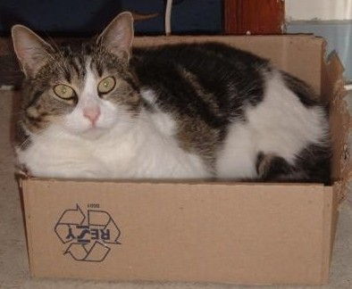

# This is a not sub-heading
## However, this is a subheading
### I guess this is a sub<sup>2</sup>-heading

**Chex mix bold flavor is my favorite flavor**

*The text equivalent of the Leaning Tower of Pisa*

~~Strikethrough makes things hard to read in my opinion, probably for the reason that it's usually mistakes~~

**Nested markdown is _nested_**

***The chex mix bold flavor version of the Leaning Tower of Pisa***

One of my favorite sayings (attributed to John Maxwell):
> It's said that a wise person learns from his mistakes. A wiser one learns from others' mistakes. But the wisest person of all learns from others's successes.

Here's the exact list of commands I did for part 2 of this lab:
```
git clone [omitted]
git checkout -b "add-read-me"
cd lab1/
git checkout -b "add-read-me"
vim README.md
git add README.md
git commit -m "Update readme file"
git push origin main
git push origin
git push --set-upstream origin add-read-me
```

Well, I go to [UCSD](https://www.ucsd.edu/) so why not have a link to there.

# ez-section-link

I guess this is the link to the [above section](#ez-section-link).
I guess this is the link to [one of the headings at the top](#this-is-a-not-sub-heading).

This is a relative link to a picture of a cat. [Relative link](images/catto.jpg)

This *is* the picture of the cat.


- Unordered item list 1
- Unordered item list 2

1. Ordered item list 1
2. Ordered item list 2

3. Nested ordered
   - Nested ordered-unordered
     1. Bottom bun of the unordered-ordered sandwich

- [ ] Get through lockdown
- [ ] Pass this course
- [x] Have a happy new year's

# Don't look past this

@AxiosDeminence (this should be me)

I think this should auto-reference the first commit of this github pages. 3bc7c868586e5d3b3eed907cc5bb8f9c4646cd5e

I don't think I am able to do the external resources.

I do not have any GitHub apps installed.

Let's get this :bread: what about :baguette_bread:

There's paragraphs everywhere on this page.

\*backslash escaping is backslash escaping\*